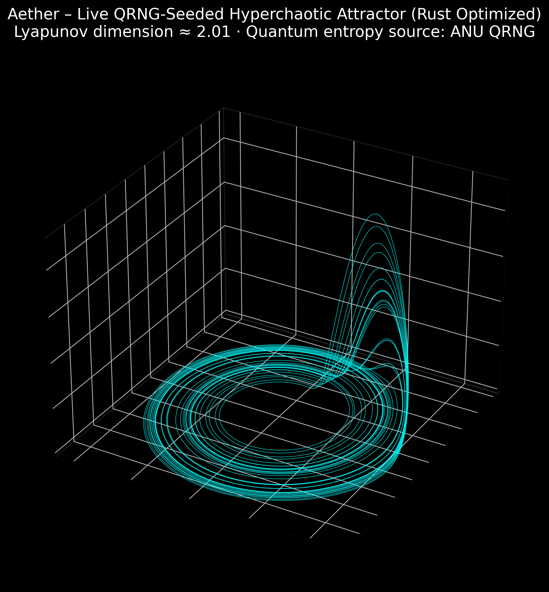

# AETHER: Chaotic Entropy & Security Suite

Aether is a high-performance cryptographic ecosystem combining **non-linear chaos theory** 
with modern security standards. It uses a **Rust-optimized Rössler attractor** core 
and hybrid quantum seeding (ANU QRNG + OS fallback).

> **Performance:** Up to **26x faster** than pure Python chaotic PRNGs, with latency ~0.38 µs/byte.

## Core Achievements

| Metric                  | Result          | Explanation                          |
|-------------------------|-----------------|--------------------------------------|
| Speedup (vs legacy Py)  | 26x+            | Rust integration                     |
| Latency (per byte)      | ~0.38 µs        | Ultra-fast real-time streams         |
| Min-Entropy             | ~7.80 bits/byte | NIST SP 800-90B compliant            |
| NIST SP 800-22          | All PASSED      | Full statistical suite passed        |
| Encryption              | AES-256-GCM     | Military-grade via AetherVault       |

## Features

- **Live Chaos Stream**: Real-time 3D visualization of the Rössler attractor.
- **Entropy Lab**: Shannon entropy scoring and bit distribution analysis.
- **Secure Vault**: Fast file encryption with chaotic keys and IVs.
- **Stegano Hideout**: Hide secrets in PNG images via LSB steganography.

## Architecture

1. **Rust Core (`AetherCore`)**: Dual Rössler attractors, Euler integration.
2. **Python Layer (`NIHDE`)**: HMAC-DRBG conditioning, health checks, quantum seeding.
3. **GUI**: Modern dark theme with CustomTkinter.

## Getting Started

```bash
git clone https://github.com/zencefilperisi/Aether
cd Aether
python -m venv venv
venv\\Scripts\\activate
pip install -r requirements.txt
cd core/chaos/aether_core_rs
maturin develop --release
cd ../../..
python aether_gui.py
```