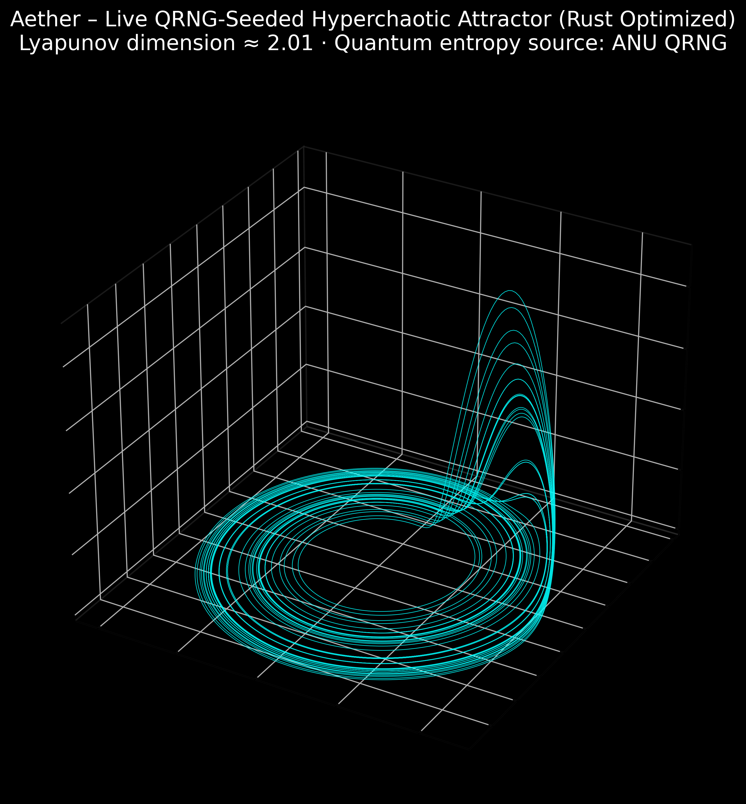

# AETHER — Chaotic Entropy & Security Suite

Aether is an experimental entropy engine that combines **non-linear chaos
theory** with modern cryptographic conditioning. A **Rust-optimized dual
Rössler attractor** core feeds an **HMAC-DRBG** conditioner (the construction
described in NIST SP 800-90A), with optional hybrid seeding from a quantum RNG
(ANU QRNG) and the OS CSPRNG.

> **Scope & honesty note.** This is a research and portfolio project, not a
> vetted cryptographic product. It has not been independently audited. The
> claims below are backed by the code and reproducible scripts in this repo —
> where a number depends on the compiled Rust core, the script says so and
> never fabricates a result. For real-world key material, use a vetted CSPRNG
> such as the OS `getrandom` / `os.urandom`.

## What's in the box

| Component | File | What it does |
|-----------|------|--------------|
| Rust chaotic core | `core/chaos/aether_core_rs/` | Dual Rössler system, RK4 integration, SHA-256 extraction |
| Conditioning engine | `core/chaos/nihde.py` | HMAC-DRBG (SP 800-90A), 3 entropy sources, health check |
| Key vault | `utility/vault.py` | Passphrase-protected keystore + AES-256-GCM file encryption |
| Key generator | `utility/keygen.py` | Keys, hex keys, mnemonic passphrases |
| Steganography | `utility/stego.py` | LSB hiding of data in PNG images |
| NIST SP 800-22 suite | `tests/nist_sp800_22.py` | All 15 randomness tests, from scratch |
| Suite self-validation | `tests/validate_nist.py` | Proves the tests themselves are correct |
| GUI | `aether_gui.py` | CustomTkinter dark-theme front-end |
| Benchmark | `aether_benchmarks.py` | Honest comparison vs os.urandom, secrets, numpy |

## Entropy validation — the full NIST SP 800-22 suite

`tests/nist_sp800_22.py` implements **all fifteen** tests from NIST SP 800-22
Rev 1a from scratch (NumPy/SciPy only, no external STS library):

Frequency (Monobit), Block Frequency, Runs, Longest Run of Ones, Binary Matrix
Rank, DFT (Spectral), Non-overlapping Template, Overlapping Template, Maurer's
Universal, Linear Complexity, Serial, Approximate Entropy, Cumulative Sums,
Random Excursions, Random Excursions Variant.

The implementation is itself validated two ways (run `python -m tests.validate_nist`):

1. **Against the specification's worked examples** — it reproduces the exact
   p-values printed in SP 800-22 (Monobit `0.109599`, Runs `0.147232`,
   Approximate Entropy `0.261961`).
2. **Negative controls** — deliberately non-random inputs (constant, periodic,
   biased) correctly *fail*, while genuine CSPRNG output passes.

```bash
# Run the whole suite against the Aether engine (needs the Rust core built):
python tests/nist_sp800_22.py --bits 1000000 --source nihde

# Or sanity-check the suite itself against os.urandom:
python tests/nist_sp800_22.py --bits 1000000 --source urandom
```

## Benchmarks — an honest comparison

`aether_benchmarks.py` measures Aether against generators a developer would
actually use, and labels which are cryptographically intended:

- `os.urandom` and `secrets` (OS CSPRNG — the practical gold standard)
- NumPy PCG64 and MT19937 (fast, **not** for keys)
- a **pure-Python** version of the *same* Rössler core (the honest "before
  Rust" baseline)

The headline speedup is reported as **Rust vs the same core in pure Python** —
not against an artificially slow strawman. Aether trades raw throughput for an
auditable chaotic + quantum construction; it does not claim to beat the OS
CSPRNG on speed.

```bash
python aether_benchmarks.py --bytes 1000000
```

## Security model (and its limits)

- **File encryption** uses AES-256-GCM (authenticated). Tampering and wrong
  passphrases are detected and rejected.
- **Key storage**: keys are encrypted at rest with a key derived from a master
  passphrase via **scrypt** (memory-hard). Only salt/nonce/ciphertext hit disk.
- **Secrets**: the ANU QRNG API key is read from the environment / `.env`
  (see `.env.example`) — never hard-coded. Without a key, the quantum source is
  skipped and the engine runs on chaos + OS entropy.
- **Not** audited, **not** side-channel hardened, **not** a KMS replacement.

## Getting started

```bash
git clone https://github.com/zencefilperisi/Aether
cd Aether
python -m venv venv
source venv/bin/activate          # Windows: venv\Scripts\activate
pip install -r requirements.txt

# Build the Rust core (needs the Rust toolchain + maturin):
pip install maturin
cd core/chaos/aether_core_rs && maturin develop --release && cd -

# Run the tests:
pytest -q

# Launch the GUI:
python aether_gui.py
```

### CLI

```bash
python aether.py --gen-key              # 256-bit hex key
python aether.py --gen-phrase           # 12-word mnemonic
python aether.py --encrypt secret.txt   # AES-256-GCM (prompts for passphrase)
python aether.py --decrypt secret.txt.aether
python aether.py --visualize            # live 3D Rössler attractor
```

### Docker

```bash
docker build -t aether .
docker run --rm aether python aether.py --gen-key
```

## Architecture

1. **Rust core (`AetherCore`)** — two Rössler attractors advanced with
   fourth-order Runge-Kutta (RK4); state hashed with SHA-256 per step.
2. **Python layer (`NIHDE`)** — HMAC-DRBG conditioning, hybrid quantum/OS
   seeding, repetition-count health check.
3. **Applications** — vault, key generator, steganography, GUI, benchmarks.

The Rössler system:

```
dx/dt = -y - z
dy/dt = x + a·y
dz/dt = b + z·(x - c)
```

## Continuous integration

`.github/workflows/ci.yml` builds the Rust core, runs the pytest suite,
validates the NIST implementation, and smoke-tests the engine against the
SP 800-22 suite on every push — across Python 3.11 and 3.12.

## The Randomness Beacon (`beacon/`)

The entropy engine also powers a live, verifiable **randomness beacon** — a
FastAPI service that emits one signed, hash-chained pulse per period and lets
anyone verify the whole history hasn't been tampered with. It's a full backend
stack around the Aether core: async API, PostgreSQL, Redis cache, a RabbitMQ
event seam, and an independent audit-worker microservice, all wired together
with Docker Compose.

```bash
cd beacon
docker compose up --build      # http://localhost:8000
```

See [`beacon/README.md`](beacon/README.md) for the architecture and endpoints.


## License

See [LICENSE](LICENSE).
